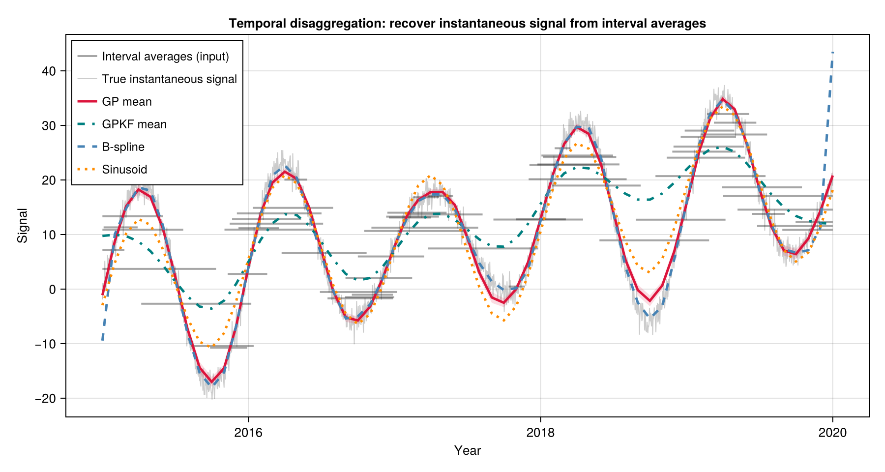
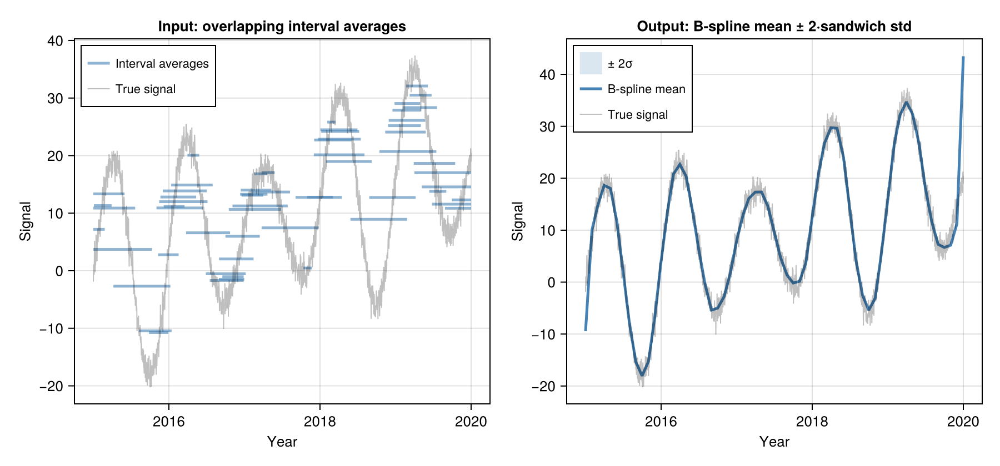
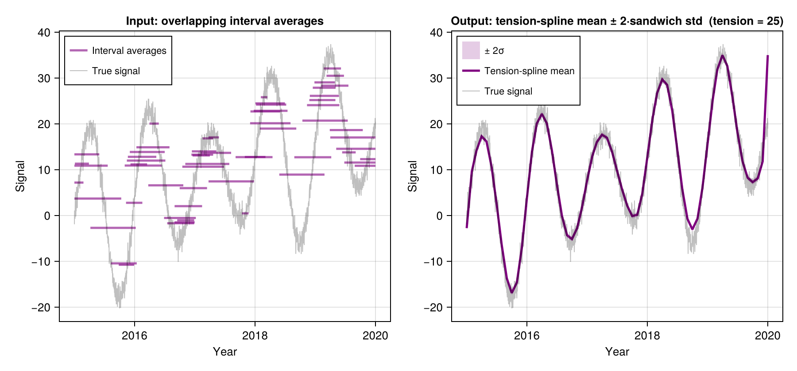
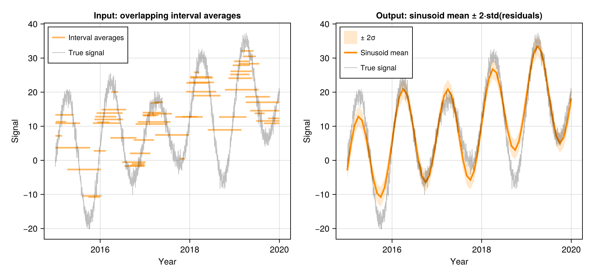
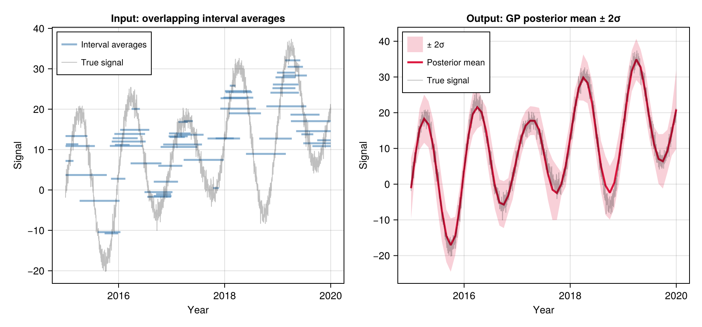

# TemporalDisaggregations.jl

[](https://alex-s-gardner.github.io/TemporalDisaggregations.jl/dev/)

Reconstruct instantaneous time series from **interval-averaged observations** — measurements that represent the average of a signal over a time window rather than a point-in-time snapshot.



## Installation

```julia
using Pkg
Pkg.add("TemporalDisaggregations")
```

## The Problem

Many real-world measurements are temporal averages rather than point observations. Examples include:
- **Remote sensing**: satellite image-pair velocities averaged over a revisit period
- **Hydrology**: stream-gauge discharge totals over reporting intervals
- **Climatology**: monthly or seasonal summaries of daily observations
- **Finance**: period-average prices or returns

When intervals are irregular, overlapping, or sparse, standard interpolation fails. `TemporalDisaggregations.jl` solves this inverse problem: given a set of interval averages — each one the mean of an unknown signal over a time window — it recovers the underlying instantaneous signal on a regular output grid, along with uncertainty estimates.

$$y_i \approx \frac{1}{\Delta t_i} \int_{t_{1,i}}^{t_{2,i}} x(t) \, dt$$

## Quick Start

```julia
using TemporalDisaggregations
using Dates
using DimensionalData: dims, Ti

# Your data: interval-averaged observations
y  = [2.3, 1.8, 3.1, 2.7, ...]          # observed averages
t1 = [Date(2020,1,5), Date(2020,2,3), ...]  # interval start dates
t2 = [Date(2020,1,28), Date(2020,3,10), ...]  # interval end dates

# Reconstruct on a monthly grid (default: Spline method)
result = disaggregate(Spline(), y, t1, t2)

# Access results
values = result[:signal]    # DimArray — instantaneous signal at each output time
stds   = result[:std]       # DimArray — method-dependent standard deviation

# Plot (requires CairoMakie)
using CairoMakie
lines(result[:signal])
```

## Methods

All three methods share the same interface and return type. Switch methods by passing a different algorithm struct as the first argument.

### B-spline (`Spline`)

Fits a smooth curve whose running averages match the observations. A regularisation parameter controls how smooth the result is; an optional tension penalty suppresses oscillation near sparse regions.

```julia
result = disaggregate(Spline(
    smoothness    = 1e-3,       # larger = smoother
    tension       = 0.0,        # > 0 suppresses oscillation
    penalty_order = 3,          # order of difference penalty
), y, t1, t2; loss_norm = :L2)
```

**Uncertainty:** Confidence band derived from how strongly the regularisation constrains the fit.



### Tension-spline (`Spline` with `tension > 0`)

Adding tension stiffens the curve in data-sparse regions — think of pulling the spline taut like a guitar string. It suppresses oscillation while preserving fidelity where observations are dense.

```julia
result = disaggregate(Spline(
    smoothness = 1e-3,
    tension    = 10.0,    # 0.5–1 moderate; 5–10 near piecewise-linear
), y, t1, t2)
```



### Sinusoid (`Sinusoid`)

Fits the parametric model

$$x(t) = \mu + \beta(t - \bar{t}) + \gamma(\text{year}) + A\sin(2\pi t) + B\cos(2\pi t)$$

where `μ` is the mean, `β` is a linear trend, `γ(year)` is a per-year anomaly, and `A`, `B` are annual seasonal amplitudes. All integrals are solved analytically, making this the fastest of the three methods. Fitted parameters are accessible in the result metadata.

```julia
result = disaggregate(Sinusoid(
    smoothness_interannual = 1e-2,   # ridge penalty on year-to-year anomalies
), y, t1, t2)

# Fitted parameters
using DimensionalData: metadata
md = metadata(result)
md[:amplitude]    # seasonal amplitude √(A²+B²)
md[:phase]        # peak time within year (fraction)
md[:trend]        # linear trend (units/year)
md[:interannual]  # Dict{Int,Float64} of per-year anomalies
```

**Uncertainty:** Propagated from the fitted model coefficients via standard weighted least squares.



### Gaussian Process (`GP`)

Models the signal as a Gaussian Process — a flexible probabilistic model encoding correlations through time. A sparse approximation keeps computation fast even for long records. Specify the correlation structure via a `KernelFunctions.jl` kernel.

```julia
using KernelFunctions

k = 15.0^2 * PeriodicKernel(r=[0.5]) * with_lengthscale(Matern52Kernel(), 3.0) +
     5.0^2 * with_lengthscale(Matern52Kernel(), 2.0)

result = disaggregate(GP(
    kernel    = k,
    obs_noise = 4.0,    # observation noise variance σ²
    n_quad    = 5,      # numerical integration points per interval (5 is usually enough)
), y, t1, t2)
```

**Uncertainty:** Full GP posterior standard deviation — a true probabilistic credible interval given the chosen kernel.



## Common Options

### Output Resolution

```julia
# Daily output
result = disaggregate(Spline(), y, t1, t2; output_period = Day(1))

# Weekly output
result = disaggregate(Spline(), y, t1, t2; output_period = Week(1))

# Monthly output on the 15th of each month (instead of the 1st)
result = disaggregate(Spline(), y, t1, t2; output_start = Date(2020, 1, 15))

# Weekly output starting from a specific date
result = disaggregate(Spline(), y, t1, t2; output_period = Week(1), output_start = Date(2020, 1, 8))
```

The `output_start` kwarg anchors the output grid. For `Month` steps, only the day-of-month matters — the grid automatically starts from the correct month for your data. For other step sizes, `output_start` is used as the literal first grid point.

### Robust L1 Loss

All methods support `loss_norm = :L1` for robustness to blunders (outliers). L1 loss down-weights suspicious observations automatically, without needing to identify them manually:

```julia
result = disaggregate(GP(obs_noise = 4.0), y, t1, t2; loss_norm = :L1)
```

## Return Type

All methods return a `DimStack` (from [DimensionalData.jl](https://github.com/rafaqz/DimensionalData.jl)) with two layers:

```julia
result[:signal]    # DimArray — instantaneous signal value at a point in time (Ti)
result[:std]       # DimArray — method dependent standard deviation at a point in time (Ti)
```


> **Note: `std` values are not directly comparable across methods.**
> Each method derives uncertainty differently, so the magnitude and shape of `std` reflects the method's statistical framework rather than a universal measure of confidence:
>
> | Method | What `std` measures | Key caveat |
> |--------|---------------------|------------|
> | **GP** | True Bayesian uncertainty from the GP model | Depends on your choice of kernel and `obs_noise` |
> | **Spline** | How strongly the regularisation constrains the fit | Controlled by `smoothness`; does not account for uncertainty in the smoothness level itself |
> | **Sinusoid** | Uncertainty in the fitted seasonal parameters | Only valid if the true signal is well-described by mean + trend + sinusoid |
>
> When using `loss_norm = :L1`, `std` is approximate — it is computed from the final reweighted system, not from L1 theory.

DimStacks provide an intuitive summary when displayed in the REPL:

```julia
julia> result
┌ 48-element DimStack ┐
├─────────────────────┴────────────────────────────────────────────────────────────────────── dims ┐
  ↓ Ti Sampled{Date} [Date("2020-01-01"), …, Date("2023-12-01")] ForwardOrdered Irregular Points
├────────────────────────────────────────────────────────────────────────────────────────── layers ┤
  :signal eltype: Float64 dims: Ti size: 48
  :std    eltype: Float64 dims: Ti size: 48
├──────────────────────────────────────────────────────────────────────────────────────── metadata ┤
  Dict{Symbol, Any} with 6 entries:
  :output_period => Month(1)
  :method        => :gp
  :obs_noise     => 4.0
  :loss_norm     => :L2
  :kernel        => Sum of 2 kernels:…
  :n_quad        => 5
└──────────────────────────────────────────────────────────────────────────────────────────────────┘
```

and you can access a single variable like this
```julia
result[:signal]
┌ 48-element DimArray{Float64, 1} signal ┐
├────────────────────────────────────────┴─────────────────────────────────────────────────── dims ┐
  ↓ Ti Sampled{Date} [Date("2020-01-01"), …, Date("2023-12-01")] ForwardOrdered Irregular Points
└──────────────────────────────────────────────────────────────────────────────────────────────────┘
 2020-01-01   -8.39559
 2020-02-01    0.754019
 2020-03-01    6.99415
 ⋮
 2023-11-01  -10.0144
 2023-12-01   -3.80605
```

DimensionalData arrays work directly with Makie.jl for plotting:

```julia
# Install CairoMakie if you don't have it:
using Pkg; Pkg.add("CairoMakie")
using CairoMakie
lines(result[:signal])   # x-axis = dates, y-axis = signal values
```

![Quick-start: lines(result[:signal])](docs/images/quickstart_lines_signal.png)

## Dependencies

- [BasicBSpline.jl](https://github.com/hyrodium/BasicBSpline.jl) — B-spline basis evaluation (spline method)
- [AbstractGPs.jl](https://github.com/JuliaGaussianProcesses/AbstractGPs.jl) + [KernelFunctions.jl](https://github.com/JuliaGaussianProcesses/KernelFunctions.jl) — GP prior and kernel definitions (GP method)
- [FastGaussQuadrature.jl](https://github.com/JuliaApproximation/FastGaussQuadrature.jl) — Gauss-Legendre quadrature (GP method)
- [DimensionalData.jl](https://github.com/rafaqz/DimensionalData.jl) — labelled array return type (all methods)
