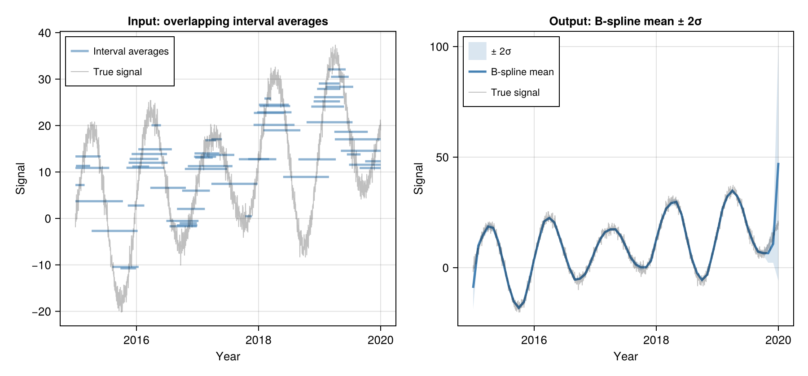
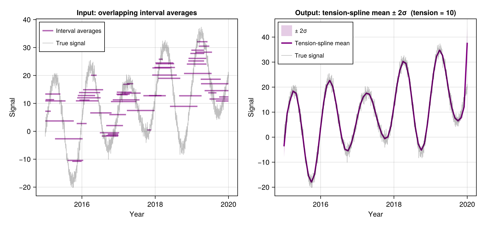
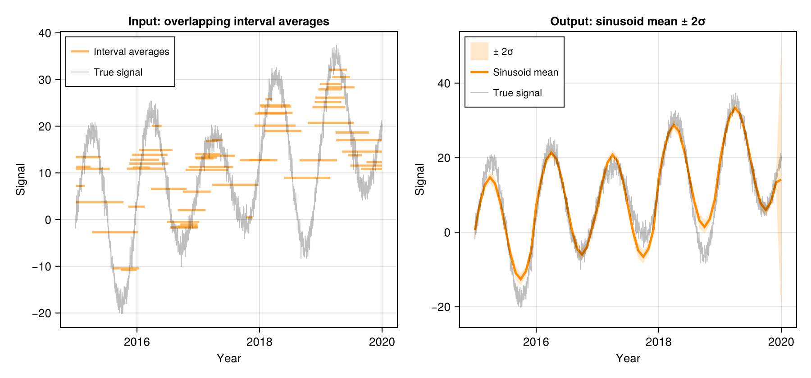

# Methods {#Methods}

All three methods share the same interface and return type. Switch with a single keyword argument.

## B-spline (`method = :spline`) {#B-spline-method-:spline}

Fits a smooth curve whose running averages match the observations. A regularisation parameter controls smoothness; an optional tension penalty suppresses oscillation near sparse regions.

```julia
result = disaggregate(y, t1, t2;
    method        = :spline,
    smoothness    = 1e-3,       # larger = smoother
    tension       = 0.0,        # > 0 suppresses oscillation
    penalty_order = 3,          # order of difference penalty
    loss_norm     = :L2,        # or :L1 for robustness to blunders
)
```


**Uncertainty:** Confidence band derived from how strongly regularisation constrains the fit.





## Tension-spline (`method = :spline`, `tension > 0`) {#Tension-spline-method-:spline,-tension-0}

Adding tension stiffens the curve in data-sparse regions — think of pulling the spline taut like a guitar string. It suppresses oscillation while preserving fidelity where observations are dense.

```julia
result = disaggregate(y, t1, t2;
    method     = :spline,
    smoothness = 1e-3,
    tension    = 10.0,    # 0.5–1 moderate; 5–10 near piecewise-linear
    loss_norm  = :L2,
)
```





## Sinusoid (`method = :sinusoid`) {#Sinusoid-method-:sinusoid}

Fits the parametric model:

```
x(t) = μ + β·(t − t̄) + γ(year) + A·sin(2πt) + B·cos(2πt)
```


where `μ` is the mean, `β` is a linear trend, `γ(year)` is a per-year anomaly, and `A`, `B` are annual seasonal amplitudes. All integrals are solved analytically — making this the fastest method.

```julia
result = disaggregate(y, t1, t2;
    method                 = :sinusoid,
    smoothness_interannual = 1e-2,   # ridge penalty on year-to-year anomalies
    loss_norm              = :L2,
)

# Fitted parameters
using DimensionalData: metadata
md = metadata(result)
md[:amplitude]    # seasonal amplitude √(A²+B²)
md[:phase]        # peak time within year (fraction)
md[:trend]        # linear trend (units/year)
md[:interannual]  # Dict{Int,Float64} of per-year anomalies
```


**Uncertainty:** Propagated from fitted model coefficients via weighted least squares.





## Gaussian Process (`method = :gp`) {#Gaussian-Process-method-:gp}

Models the signal as a Gaussian Process — a flexible probabilistic model encoding correlations through time. A sparse approximation keeps computation fast even for long records. Specify the correlation structure via a [KernelFunctions.jl](https://github.com/JuliaGaussianProcesses/KernelFunctions.jl) kernel.

```julia
using KernelFunctions

k = 15.0^2 * PeriodicKernel(r=[0.5]) * with_lengthscale(Matern52Kernel(), 3.0) +
     5.0^2 * with_lengthscale(Matern52Kernel(), 2.0)

result = disaggregate(y, t1, t2;
    method    = :gp,
    kernel    = k,
    obs_noise = 4.0,    # observation noise variance σ²
    n_quad    = 5,      # Gauss-Legendre quadrature points per interval
    loss_norm = :L2,
)
```


**Uncertainty:** Full GP posterior standard deviation — a true probabilistic credible interval given the chosen kernel.


## Uncertainty Comparison {#Uncertainty-Comparison}

::: warning Warning

`std` values are not directly comparable across methods. Each method derives uncertainty differently:

:::

|       Method |                            What `std` measures |                                                                                  Key caveat |
| ------------:| ----------------------------------------------:| -------------------------------------------------------------------------------------------:|
|       **GP** |    True Bayesian uncertainty from the GP model |                                            Depends on your choice of kernel and `obs_noise` |
|   **Spline** | How strongly regularisation constrains the fit | Controlled by `smoothness`; does not account for uncertainty in the smoothness level itself |
| **Sinusoid** |  Uncertainty in the fitted seasonal parameters |                  Only valid if the true signal is well-described by mean + trend + sinusoid |


When using `loss_norm = :L1`, `std` is approximate — computed from the final reweighted system, not from L1 theory.
