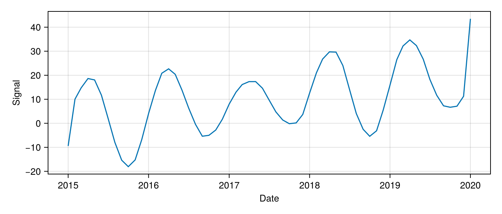

# Getting Started

## Installation

```julia
using Pkg
Pkg.add("TemporalDisaggregations")
```

## Quick Start

```julia
using TemporalDisaggregations
using Dates
using DimensionalData: dims, Ti

# Your data: interval-averaged observations
y  = [2.3, 1.8, 3.1, 2.7, ...]              # observed averages
t1 = [Date(2020,1,5), Date(2020,2,3), ...]   # interval start dates
t2 = [Date(2020,1,28), Date(2020,3,10), ...]  # interval end dates

# Reconstruct on a monthly grid (Spline method by default)
result = disaggregate(Spline(), y, t1, t2)

# Access results
dates  = collect(dims(result.signal, Ti))   # Vector{Date}
values = result[:signal].data   # Vector{Float64} — reconstructed signal
stds   = result[:std].data      # Vector{Float64} — sandwich std (spatially-varying)
```

## Plotting

DimensionalData arrays work directly with Makie.jl:

```julia
using CairoMakie
lines(result[:signal])   # x-axis = dates, y-axis = signal values
```



## Return Type

All methods return a `DimStack` with two layers:

```julia
result[:signal]    # DimArray — instantaneous signal at each output time
result[:std]       # DimArray — sandwich std (lower in dense regions, higher in sparse regions)
```

```julia
julia> result
┌ 48-element DimStack ┐
├─────────────────────┴────────────────────────────────────────────────────────────────────── dims ┐
  ↓ Ti Sampled{Date} [Date("2020-01-01"), …, Date("2023-12-01")] ForwardOrdered Irregular Points
├────────────────────────────────────────────────────────────────────────────────────────── layers ┤
  :signal eltype: Float64 dims: Ti size: 48
  :std    eltype: Float64 dims: Ti size: 48
├──────────────────────────────────────────────────────────────────────────────────────── metadata ┤
  Dict{Symbol, Any} with 6 entries:
  :output_period => Month(1)
  :method        => :gp
  ...
└──────────────────────────────────────────────────────────────────────────────────────────────────┘
```

## Output Resolution

```julia
# Daily output
result = disaggregate(Spline(), y, t1, t2; output_period = Day(1))

# Weekly output
result = disaggregate(Spline(), y, t1, t2; output_period = Week(1))

# Monthly output on the 15th of each month (instead of the 1st)
result = disaggregate(Spline(), y, t1, t2; output_start = Date(2020, 1, 15))
```

## Robust L1 Loss

All methods support `loss_norm = :L1` for robustness to outliers:

```julia
result = disaggregate(GP(obs_noise = 4.0), y, t1, t2; loss_norm = :L1)
```

L1 loss automatically down-weights suspicious observations via IRLS.
