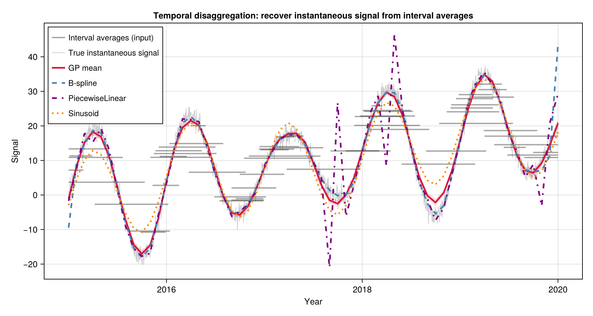

```@raw html
---
layout: home

hero:
  name: "TemporalDisaggregations.jl"
  text: "Recover signals from interval averages"
  tagline: Reconstruct instantaneous time series from overlapping, irregular interval-averaged observations — with uncertainty estimates.
  actions:
    - theme: brand
      text: Get Started
      link: /getting_started
    - theme: alt
      text: View on GitHub
      link: https://github.com/alex-s-gardner/TemporalDisaggregations.jl

features:
  - title: Four Methods
    details: B-spline, piecewise-linear, sinusoid, and Gaussian Process — all sharing the same interface. Switch by passing a different algorithm struct.
  - title: Uncertainty Estimates
    details: Every method returns a spatially-varying sandwich std alongside the reconstructed signal — lower where observations are dense, higher where they are sparse.
  - title: Robust to Outliers
    details: All methods support L1 loss via IRLS, automatically down-weighting suspicious observations.
---
```

## Overview

Many real-world measurements are temporal averages rather than point observations:

- **Remote sensing**: satellite image-pair velocities averaged over a revisit period
- **Hydrology**: stream-gauge discharge totals over reporting intervals
- **Climatology**: monthly or seasonal summaries of daily observations
- **Finance**: period-average prices or returns

When intervals are irregular, overlapping, or sparse, standard interpolation fails. `TemporalDisaggregations.jl` solves this inverse problem: given interval averages, recover the underlying instantaneous signal on a regular output grid.

In math: `yᵢ ≈ (1/Δtᵢ) ∫_{t1ᵢ}^{t2ᵢ} x(t) dt`


